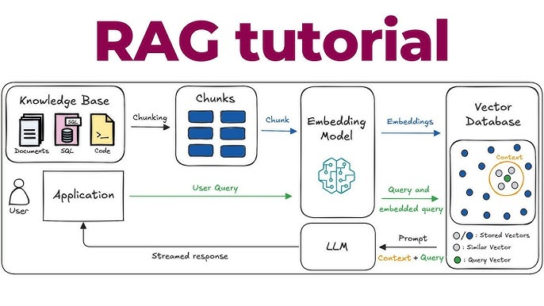

# 📚 RAG Chatbot với LangChain + Gemini + FAISS

> Dự án xây dựng hệ thống **Retrieval-Augmented Generation (RAG)** cho phép hỏi đáp dựa trên nội dung các file PDF của riêng bạn, sử dụng LangChain, Google Gemini và FAISS vector database.

---

## 🗂️ Mục lục

1. [RAG là gì? Tại sao cần nó?](#1-rag-là-gì-tại-sao-cần-nó)
2. [Kiến trúc dự án](#2-kiến-trúc-dự-án)
3. [Cấu trúc thư mục](#3-cấu-trúc-thư-mục)
4. [Các khái niệm cốt lõi cần hiểu](#4-các-khái-niệm-cốt-lõi-cần-hiểu)
5. [Hướng dẫn cài đặt](#5-hướng-dẫn-cài-đặt)
6. [Hướng dẫn chạy dự án](#6-hướng-dẫn-chạy-dự-án)
7. [Giải thích code chi tiết](#7-giải-thích-code-chi-tiết)
8. [Test & đánh giá chất lượng RAG](#8-test--đánh-giá-chất-lượng-rag)
9. [Tuning & mở rộng](#9-tuning--mở-rộng)
10. [FAQ & lỗi thường gặp](#10-faq--lỗi-thường-gặp)

---

## 1. RAG là gì? Tại sao cần nó?



**LLM (như ChatGPT, Gemini) có giới hạn:**

- Chỉ biết thông tin đến ngày được huấn luyện (knowledge cutoff).
- Không biết về tài liệu **nội bộ / riêng tư** của bạn.
- Dễ "hallucinate" (bịa ra thông tin) khi không có dữ liệu.

**RAG (Retrieval-Augmented Generation) giải quyết vấn đề này bằng 2 bước:**

```
[Câu hỏi của user]
       │
       ▼
┌─────────────────┐     ┌──────────────────────┐
│   RETRIEVAL     │────▶│  Vector Database      │
│  Tìm kiếm các  │     │  (FAISS / Chroma)     │
│  đoạn văn liên  │     │  Chứa embedding của   │
│  quan nhất      │     │  toàn bộ tài liệu PDF │
└─────────────────┘     └──────────────────────┘
       │
       ▼ (các đoạn văn liên quan — "context")
┌─────────────────┐
│   GENERATION    │
│  Gemini LLM trả │
│  lời DỰA TRÊN  │
│  context thật   │
└─────────────────┘
       │
       ▼
[Câu trả lời có nguồn gốc]
```

---

## 2. Kiến trúc dự án

Dự án được tách thành **2 bước rõ ràng:**

### Bước 1 — Xây dựng Vector Database (`build_db.py`)

Chạy **một lần duy nhất** (hoặc khi có PDF mới).

```
PDF files  ──▶  Loader  ──▶  Text Splitter  ──▶  Embedding Model  ──▶  FAISS DB (lưu xuống ổ cứng)
```

### Bước 2 — Chatbot hỏi đáp (`chat.py`)

Chạy **mỗi lần muốn hỏi**, load DB đã có sẵn, không cần xử lý PDF lại.

```
Câu hỏi  ──▶  Embedding  ──▶  FAISS tìm chunk liên quan  ──▶  Prompt + LLM  ──▶  Câu trả lời
```

> **`all_in_one.py`** — Gộp cả 2 bước vào một file, dùng để **học và hiểu luồng** toàn bộ hệ thống.

---

## 3. Cấu trúc thư mục

```
rag-project/
│
├── papers/                  # ← Đặt các file PDF của bạn vào đây
│   └── your_document.pdf
│
├── faiss_db_gemini/         # Tự sinh ra sau khi chạy build_db.py
│   ├── index.faiss
│   └── index.pkl
│
├── public/                  # Hình ảnh cho README
│   ├── rag.jpg
│   └── distance_strategy.png
│
├── all_in_one.py            # File học — toàn bộ pipeline trong 1 file
├── build_db.py              # Bước 1: Đọc PDF → Tạo Vector DB
├── chat.py                  # Bước 2: Load DB → Chatbot hỏi đáp
│
├── .env                     # Biến môi trường (API key) — KHÔNG commit lên git
├── .env.example             # Mẫu file .env
├── requirements.txt
└── README.md
```

---

## 4. Các khái niệm cốt lõi cần hiểu

### 4.1 Document Loader

Đọc file PDF và chuyển thành object `Document` của LangChain, mỗi document có:

- `page_content`: nội dung text
- `metadata`: thông tin nguồn (`source`, `page`, ...)

```python
loader = DirectoryLoader(path="./papers", glob="**/*.pdf", loader_cls=UnstructuredFileLoader)
docs = loader.load()
```

### 4.2 Text Splitter (Chunking)

LLM có giới hạn context window, và vector search hoạt động tốt hơn trên đoạn văn ngắn. Ta cắt tài liệu thành các **chunk** nhỏ hơn:

```python
text_splitter = RecursiveCharacterTextSplitter(
    chunk_size=1200,    # Mỗi chunk tối đa 1200 ký tự
    chunk_overlap=200,  # 200 ký tự overlap giữa 2 chunk liền kề
                        # → tránh bị cắt đứt ý tưởng ở ranh giới
)
```

> **Tại sao cần overlap?** Nếu một câu quan trọng nằm ở ranh giới 2 chunk, overlap đảm bảo câu đó xuất hiện đầy đủ trong ít nhất một chunk.

### 4.3 Embedding

Chuyển đoạn text thành **vector số** (mảng float nhiều chiều) sao cho các đoạn có nghĩa tương đồng sẽ có vector gần nhau trong không gian vector.

```python
embeddings = GoogleGenerativeAIEmbeddings(model="gemini-embedding-001")
# "con chó" và "cún con" → vector gần nhau
# "con chó" và "phương trình vi phân" → vector xa nhau
```

### 4.4 Vector Store (FAISS)

Cơ sở dữ liệu lưu trữ và tìm kiếm vector hiệu quả. Khi có câu hỏi, FAISS tìm `k` chunk có vector gần nhất với vector của câu hỏi.

```
Distance strategies:
```


| Strategy              | Mô tả                               | Khi nào dùng                 |
| --------------------- | ----------------------------------- | ---------------------------- |
| **Cosine** (mặc định) | Đo góc giữa 2 vector, bỏ qua độ dài | Thường dùng nhất cho text    |
| **L2 (Euclidean)**    | Đo khoảng cách thẳng giữa 2 điểm    | Khi magnitude quan trọng     |
| **Inner Product**     | Tích vô hướng                       | Khi vector đã được normalize |

### 4.5 Retriever

Bọc vector store lại với cấu hình tìm kiếm:

```python
retriever = vectorstore.as_retriever(
    search_type="similarity_score_threshold",
    search_kwargs={"k": 5, "score_threshold": 0.5}
    # k=5: lấy tối đa 5 chunk
    # score_threshold=0.5: chỉ lấy chunk có độ tương đồng >= 50%
)
```

### 4.6 Prompt Template

Đóng gói câu hỏi và context vào một prompt có cấu trúc gửi cho LLM:

```python
template = (
    "You are a strict assistant for a private knowledge base.\n"
    "RULES: Use ONLY the provided context...\n\n"
    "Context: \n{context}\n\n"
    "Question: {question}"
)
```

> **Tại sao có Rules?** Ngăn LLM dùng kiến thức ngoài và "hallucinate" — buộc nó phải trả lời "I don't know" khi không tìm thấy thông tin.

### 4.7 LCEL — LangChain Expression Language

Cú pháp `|` (pipe) nối các component thành một chain:

```python
rag_chain = (
    {"context": retriever, "question": RunnablePassthrough()}
    | prompt      # điền context + question vào template
    | llm         # gửi prompt cho Gemini
    | StrOutputParser()  # chuyển output thành string
)
```

---

## 5. Hướng dẫn cài đặt

### Yêu cầu hệ thống

- Python **3.9+**
- Tài khoản Google AI Studio (lấy API key miễn phí)

### Bước 1 — Clone / tải dự án về

```bash
git clone <your-repo-url>
cd rag-project
```

### Bước 2 — Tạo môi trường ảo (khuyến nghị)

```bash
# Tạo virtual environment
python -m venv .venv

# Kích hoạt (macOS/Linux)
source .venv/bin/activate

# Kích hoạt (Windows)
.venv\Scripts\activate
```

### Bước 3 — Cài dependencies

```bash
pip install -r requirements.txt
```

### Bước 4 — Cấu hình API key

1. Truy cập [Google AI Studio](https://aistudio.google.com/apikey) → tạo API key miễn phí.
2. Copy file `.env.example` thành `.env`:

```bash
cp .env.example .env
```

3. Mở `.env` và điền API key:

```env
GOOGLE_API_KEY=AIzaSy...your_key_here...
CHROMA_DB_FOLDER_PATH=./chroma_db_gemini
FAISS_DB_FOLDER_PATH=./faiss_db_gemini
```

> ⚠️ **Không bao giờ commit file `.env` lên Git.** Đảm bảo `.env` đã có trong `.gitignore`.

### Bước 5 — Thêm file PDF

Tạo thư mục `papers/` và đặt các file PDF vào đó:

```bash
mkdir papers
# copy file PDF của bạn vào thư mục papers/
```

---

## 6. Hướng dẫn chạy dự án

### Cách A — Chạy từng bước (khuyến nghị cho production)

**Bước 1:** Xây dựng Vector Database từ PDF

```bash
python build_db.py
```

Output mong đợi:

```
1. Đang đọc file PDF từ thư mục ./papers...
100%|████████████████| 2/2 [00:03<00:00]
2. Đang chia nhỏ tài liệu (Chunking)...
3. Đang khởi tạo Gemini Embedding API...
4. Đang tạo Vector Database và lưu xuống ổ cứng...
✅ HOÀN TẤT! Dữ liệu đã được lưu vào thư mục ./faiss_db_gemini
```

> Bước này chỉ cần chạy **một lần**, hoặc khi bạn thêm/xóa PDF mới.

**Bước 2:** Chạy chatbot hỏi đáp

```bash
python chat.py
```

Output mong đợi:

```
1. Đang kết nối với Vector Database đã lưu...
2. Đang khởi tạo Gemini LLM...

✅ HỆ THỐNG SẴN SÀNG! (Gõ 'exit' hoặc 'quit' để thoát)
--------------------------------------------------

🧑 Question: Nội dung chính của tài liệu là gì?
🤖 Trả lời: ...
```

Gõ `exit` hoặc `quit` để thoát.

---

### Cách B — Chạy all-in-one (dùng để học)

```bash
python all_in_one.py
```

> File này kết hợp cả build DB lẫn chat trong một lần chạy. Tốt để hiểu toàn bộ luồng, nhưng sẽ re-embed lại toàn bộ PDF mỗi lần chạy (chậm và tốn API call).

---

## 7. Giải thích code chi tiết

### `build_db.py` — Pipeline xây dựng DB

````python
# 1. Load tất cả PDF trong thư mục ./papers
loader = DirectoryLoader(
    path="./papers",
    glob="**/*.pdf",          # đệ quy tất cả subfolder
    loader_cls=UnstructuredFileLoader,
    show_progress=True,
    use_multithreading=True   # load song song, nhanh hơn với nhiều file
)
docs = loader.load()

# 2. Cắt thành chunk nhỏ
text_splitter = RecursiveCharacterTextSplitter(
    chunk_size=1200,
    chunk_overlap=200,
    separators=["\n#{1,6} ", "```\n", "\n\n", "\n", " ", ""]
    # Thứ tự ưu tiên cắt: theo heading → code block → paragraph → dòng → từ
)
splits = text_splitter.split_documents(docs)

# 3. Embedding + lưu FAISS
embeddings = GoogleGenerativeAIEmbeddings(model="gemini-embedding-001")
vectorstore = FAISS.from_documents(documents=splits, embedding=embeddings)
vectorstore.save_local(FAISS_DB_FOLDER_PATH)
````

### `chat.py` — Pipeline chatbot

```python
# 1. Load DB đã có (không cần xử lý PDF lại)
vectorstore = FAISS.load_local(
    folder_path=FAISS_DB_FOLDER_PATH,
    embeddings=embeddings,
    allow_dangerous_deserialization=True  # cần thiết khi load file .pkl
)

# 2. Cấu hình retriever
retriever = vectorstore.as_retriever(
    search_type="similarity_score_threshold",
    search_kwargs={"k": 5, "score_threshold": 0.5}
)

# 3. Streaming response — text hiện ra từng chữ như chatbot thật
for chunk in rag_chain.stream(question):
    print(chunk, end="", flush=True)
```

---

## 8. Test & đánh giá chất lượng RAG

Sau khi chạy với các PDF bài báo khoa học mẫu, dùng bộ câu hỏi sau để kiểm tra:

### Nhóm 1 — Trích xuất thông tin cơ bản

Kiểm tra retriever có lấy đúng chunk hay không.

```
"Nghiên cứu về LINC01089 được công bố trên tạp chí nào và vào năm bao nhiêu?"
"Nhóm tác giả của nghiên cứu này đến từ những quốc gia nào?"
"Có bao nhiêu bệnh nhân được phân tích lâm sàng trong nghiên cứu này?"
```

### Nhóm 2 — Hiểu ngữ cảnh và tóm tắt

Kiểm tra LLM có đọc hiểu và diễn đạt lại được không.

```
"Mục tiêu chính của nghiên cứu này là gì?"
"Công nghệ nào đã được sử dụng để can thiệp (knockout) LINC01089?"
"Theo tài liệu, lncRNA LINC01089 đóng vai trò gì trong ung thư gan?"
```

### Nhóm 3 — Đọc bảng biểu / số liệu

Kiểm tra retriever có lấy được chunk chứa bảng dữ liệu không.

```
"Kết quả phân tích lâm sàng của 98 bệnh nhân cho thấy điều gì?"
```

### Nhóm 4 — Hallucination test ⚠️

**Quan trọng nhất!** Câu hỏi về thứ KHÔNG có trong tài liệu. LLM phải từ chối trả lời.

```
"Tài liệu có nhắc đến phương pháp hóa trị (chemotherapy) không?"
"Nghiên cứu này có thử nghiệm CRISPR-Cas9 trên bệnh nhân ung thư phổi không?"
```

✅ **Kết quả đúng:** `"I don't know based on the provided documents."`  
❌ **Kết quả sai:** LLM tự bịa ra thông tin không có trong PDF.

---

## 9. Tuning & mở rộng

### Điều chỉnh chất lượng retrieval

| Tham số           | Giá trị mặc định | Tăng lên                          | Giảm xuống               |
| ----------------- | ---------------- | --------------------------------- | ------------------------ |
| `chunk_size`      | 1200             | Context đầy đủ hơn, tốn token hơn | Tìm kiếm chính xác hơn   |
| `chunk_overlap`   | 200              | Ít bị cắt đứt ý                   | Tiết kiệm bộ nhớ         |
| `k` (số chunk)    | 5                | Nhiều ngữ cảnh hơn                | Ít nhiễu hơn             |
| `score_threshold` | 0.5              | Keát quả chắc chắn hơn            | Tìm được nhiều chunk hơn |

### Chuyển sang Chroma (nếu muốn)

`build_db.py` và `chat.py` đã có sẵn code Chroma được comment lại. Để dùng Chroma thay FAISS, bỏ comment các dòng Chroma và comment lại các dòng FAISS.

### Thêm tính năng chat history (multi-turn)

Thay `RunnablePassthrough()` bằng `RunnableWithMessageHistory` của LangChain để bot nhớ được lịch sử hội thoại.

---

## 10. FAQ & lỗi thường gặp

**Q: Lỗi `GOOGLE_API_KEY not found`**  
A: Kiểm tra file `.env` đã được tạo chưa và đã điền API key đúng chưa.

**Q: Lỗi `allow_dangerous_deserialization`**  
A: Thêm `allow_dangerous_deserialization=True` khi gọi `FAISS.load_local()`. File này chỉ load từ máy của chính bạn nên an toàn.

**Q: Bot trả lời "I don't know" với mọi câu hỏi**  
A: `score_threshold` đang quá cao. Thử giảm xuống `0.3` hoặc đổi `search_type` thành `"similarity"` (không có threshold).

**Q: Chạy `build_db.py` rất chậm**  
A: Số lượng API call tỉ lệ thuận với số chunk. Với file PDF lớn, có thể mất vài phút. Đây là lý do tại sao tách `build_db.py` và `chat.py` — chỉ build một lần.

**Q: Muốn thêm PDF mới**  
A: Copy PDF vào thư mục `papers/` và chạy lại `python build_db.py` để rebuild toàn bộ DB.

---

## 📄 License

MIT License — tự do sử dụng và chỉnh sửa.